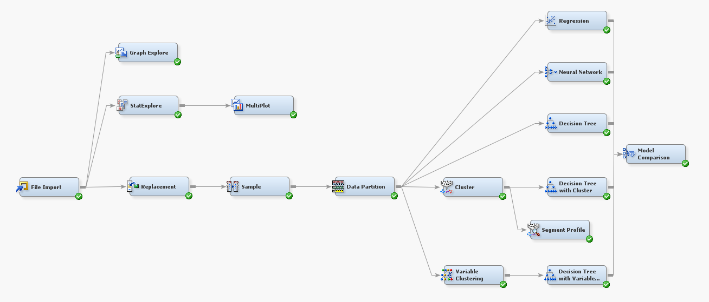
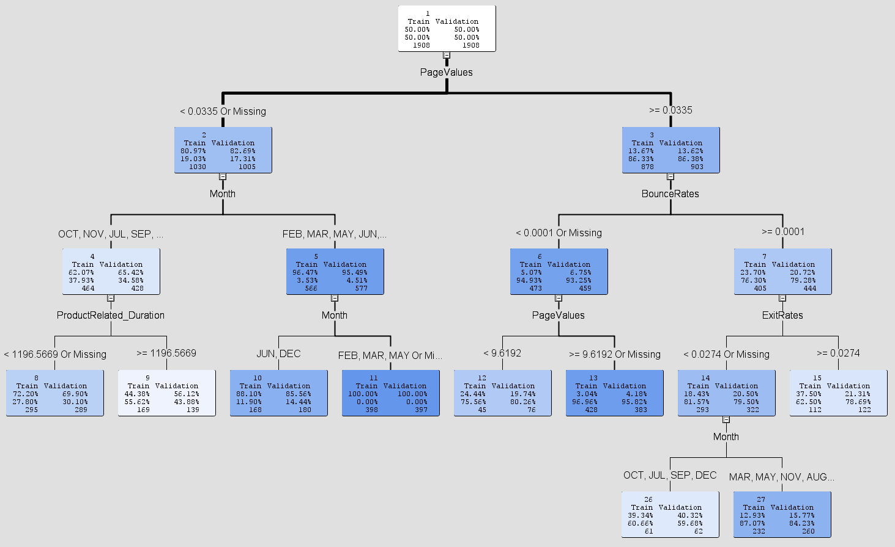
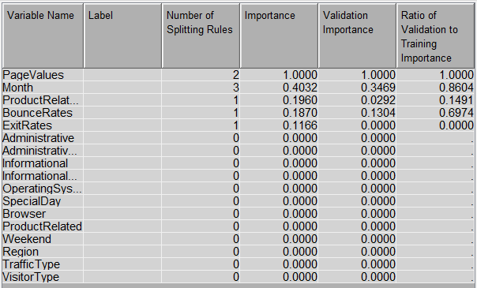
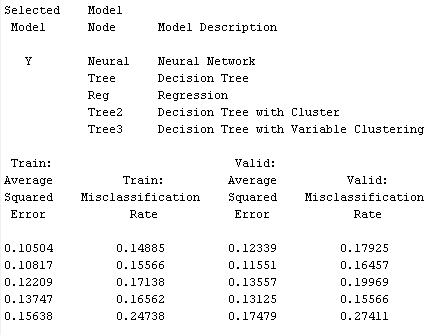
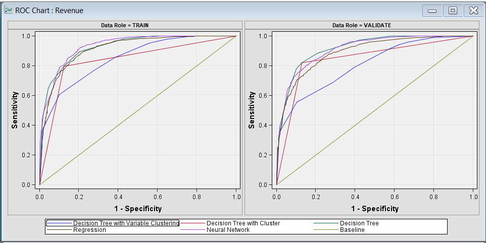
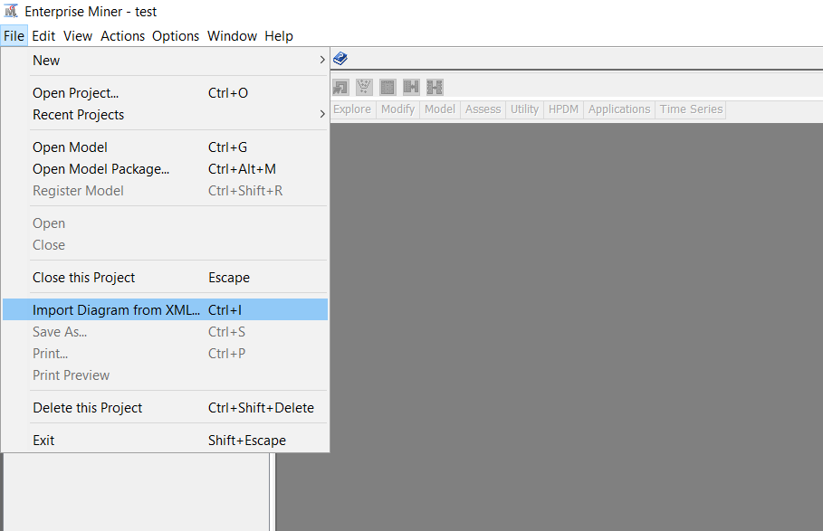
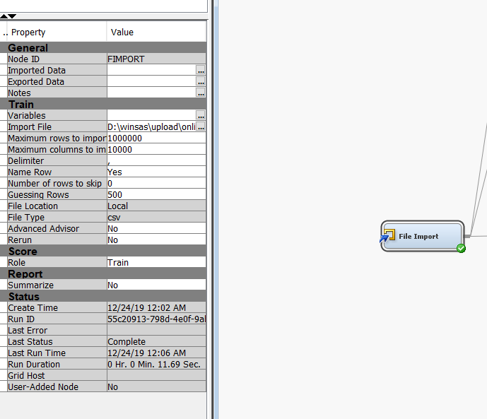
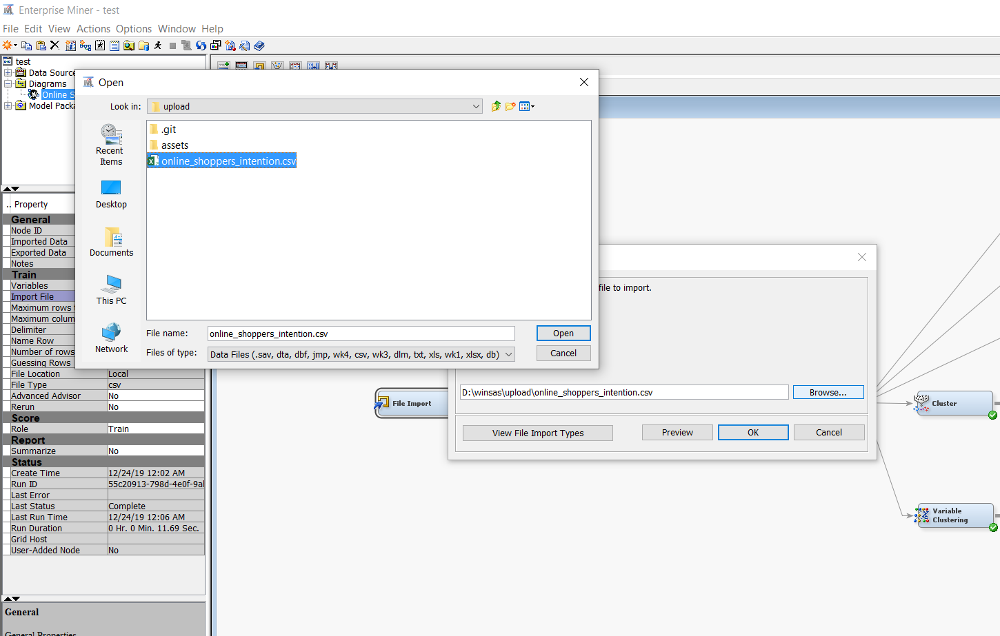

# online-shoppers-intention
Using SAS Enterprise Miner to classify site visitors to be positive or negative buyers.

 

## Project Intro
Sampling, Exploring, Modifying, Modeling, and Assessing (SEMMA) with SAS Enterprise Miner. Experiment with various methods to explore and develop models for the classification.

### Methods Used
* EDA
* Resampling
* Clustering
* Segment Profiling
* Decision Tree, Neural Network
* Evaluation

### Technologies
* SAS Enterprise Miner

## Project Description
1. **Sampling**  
Data source from [UCI Machine Learning Repository]. Data class is imbalanced with 86% of negative cases.

2. **Explore**
 - Clustering method is used in this project to segment the data.
 - The Segment Profile tool is used to examine clustered data and identify factors that differentiate data segments from the population.
 - Chi-square test shows variables *PageValues* and *ExitRates* ranked the highest.

3. **Modify**
 - Replacement of missing values.
 - Resampling of data.

4. **Model**
 - Decision Tree  
  

5. **Assessment**
 - Decision Tree ranks *PageValues* as the most important variable  
  
 - Model Comparison  
  
  
 
## Getting Started
1. Download all the files and start a new SAS Enterprise Miner project.
2. Click on `File` and select `Import diagram from XML`.
3. Import `Online Shoppers Intention.xml`.  

4. Select the File Import node. To specify the path click on Import File and browse to the location of `online_shoppers_intention.csv`.  
  

